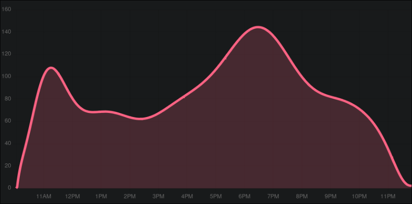

# Gymstats

This is a simple project which reads the current amount of visitors in the RWTH gym from their [website](https://buchung.hsz.rwth-aachen.de/angebote/aktueller_zeitraum/_Auslastung.html) and saves it in a database. The data is then visualized in a simple web interface. The website is available [here](https://gymstats.the-codeboy.com/).

## Challenges

The only challenge here was that the visitor count is provided as an image. I had to use OCR to extract the number from the image. I used the `pytesseract` library for this. Also since there are not many possibilities for how many visitors there can be, I save the images in a hash map so that I don't have to OCR the same image again.

### Related Projects

After making this I found a project by [dorian-K](https://github.com/dorian-K), that does pretty much the same thing. You can check it out [here](https://rwtf.dorianko.ch/)

